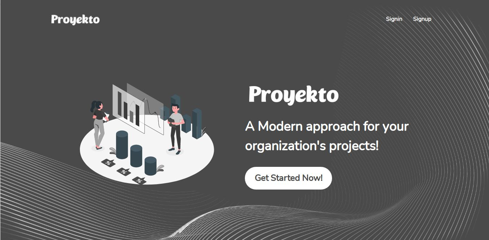
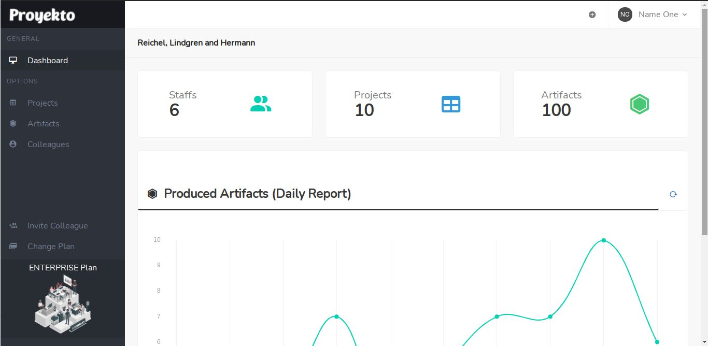
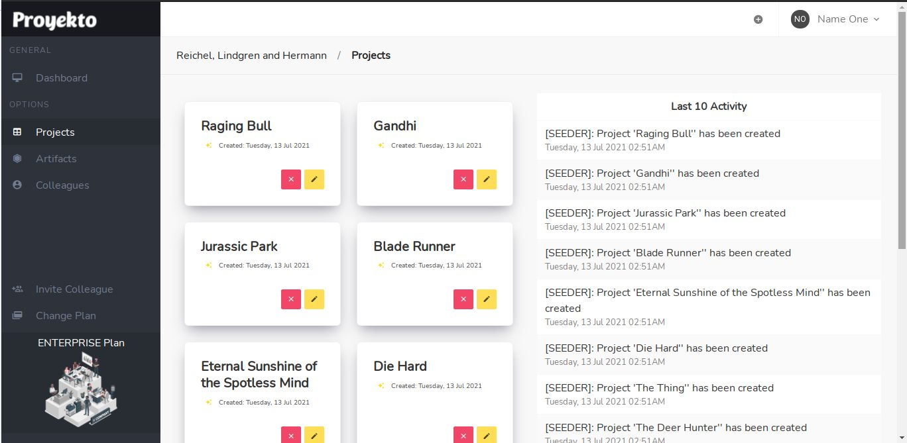

## Proyekto (SaaS App)

An app allowing organization to manage their projects by creating projects (depending on their plan) and adding their staffs on their account 

Consider checking the repo's issues, all of my todos are in there :smile:





## Setup Locally

* Environment Variables
  * Rails (```config/application.yml```)
    * PAYMONGO_PK
    * PAYMONGO_SK
    * CLOUDINARY_CLOUD_NAME
    * CLOUDINARY_API_KEY
    * CLOUDINARY_SECRET_KEY
    * CLOUDINARY_FOLDER_NAME
    * MAILTRAP_USERNAME
    * MAILTRAP_PASSWORD
    * MAILTRAP_ADDRESS
    * MAILTRAP_DOMAIN
    * MAILTRAP_PORT
  * Webpacker (```config/webpack/.env```)
    * PAYMONGO_PK

* Paymongo
  * Sign up and get API Keys https://dashboard.paymongo.com/signup
  * Set paymongo environment variables (pattern, 'PAYMONGO_*')

* Cloudinary
  * Sign up and get the needed environment variables values on your dashboard https://cloudinary.com/
  * create a folder and assign it as CLOUDINARY_FOLDER_NAME's value

* Mailtrap
  * Sign up and get the needed environment variable values here  https://mailtrap.io/

## Author: <i>Kevin Roi R. Basina</i>
<a href="https://github.com/rookiemonkey">
	
</a>
<a href="https://ph.linkedin.com/in/kevin-roi-rigor-basina-668136185">
	
</a>
<a href="https://www.facebook.com/kevinroibasina">
	
<a>
<a href="https://www.instagram.com/timemachineni_roi/">
	
</a>
<a href="https://twitter.com/tymmchineni_roi">
	
</a>
<a href="mailto: kevinroirigorbasina@protonmail.com">
	
</a>
<a href="mailto: kevinroirigorbasina@gmail.com">
	
</a>